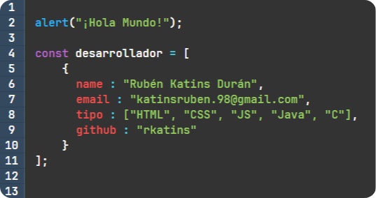

[Français](./languages/README_FR.md) · [English](./languages/README_EN.md)

<h1 align="center">Hola , soy Rubén Katins Durán</h1>
<h3 align="center">Soy técnico en Sistemas MicroInformáticos y Redes y futuro técnico superior en Desarrollo de Aplicaciones Web</h3>

- 🔭 Estoy estudiando [Desarrollo de Aplicaciones Web (DAW)](https://www.juanxxiii.net/)

- 👨‍💻 Puedes ver mis proyectos aquí: [https://github.com/rkatins](https://github.com/rkatins)

- 📫 Contactame aquí [**katinsruben.98@gmail.com**](mailto:katinsruben.98@gmail.com)

# Tecnologías:

# SO + Script

## Estadisticas

      

# Algunas de mis herramientas

# Otros contactos

<!--
## Insignias
https://github.com/Ileriayo/markdown-badges
https://ileriayo.github.io/markdown-badges/
-->

<!--
## Stats card
https://github.com/tuhinpal/readme-stats-github
-->

<!--
## Top lang
https://github.com/anuraghazra/github-readme-stats
-->
